# 🎯 PrepPal AI

> **Your Personal AI Coding Mentor powered by Google ADK, Gemini, and MCP**

PrepPal AI is an intelligent interview preparation platform that combines Google's Agent Development Kit (ADK), the Model Context Protocol (MCP), and Gemini to deliver personalized coding guidance.

Unlike traditional DSA practice platforms, PrepPal analyzes user performance, identifies weak topics, recommends targeted problems, tracks progress, and generates personalized study plans through a multi-agent AI architecture.

---

## ✨ Key Features

- 🤖 AI Coding Mentor
- 📈 Progress Analytics Dashboard
- 📚 Smart Review Queue
- 🏠 Personalized Home Dashboard
- 🏗 Multi-Agent Architecture
- 📊 Weak Topic Detection
- 🎯 Adaptive Problem Recommendation
- ⚡ Powered by Google ADK + Gemini
- 🔗 MCP Integration
- 💾 SQLite Persistence

## 🛠 Tech Stack

| Layer | Technology |
|--------|------------|
| Frontend | Streamlit |
| Backend | Python |
| AI Framework | Google Agent Development Kit (ADK) |
| LLM | Gemini 2.5 Flash |
| Agent Communication | Model Context Protocol (MCP) |
| Database | SQLite |
| Styling | Custom CSS |
| Charts | Plotly |

## 🏗 Architecture

```
          User
            │
            ▼
     Streamlit Frontend
            │
            ▼
      Google ADK Runner
            │
            ▼
         Root Agent
      ┌───────────────┐
      ▼               ▼
 Coach Agent    Tracker Agent
      │               │
      └───────┬───────┘
              ▼
         MCP Server
              │
              ▼
        SQLite Database
```
## 🚀 Features

### 🏠 Home Dashboard

<p align="center">
  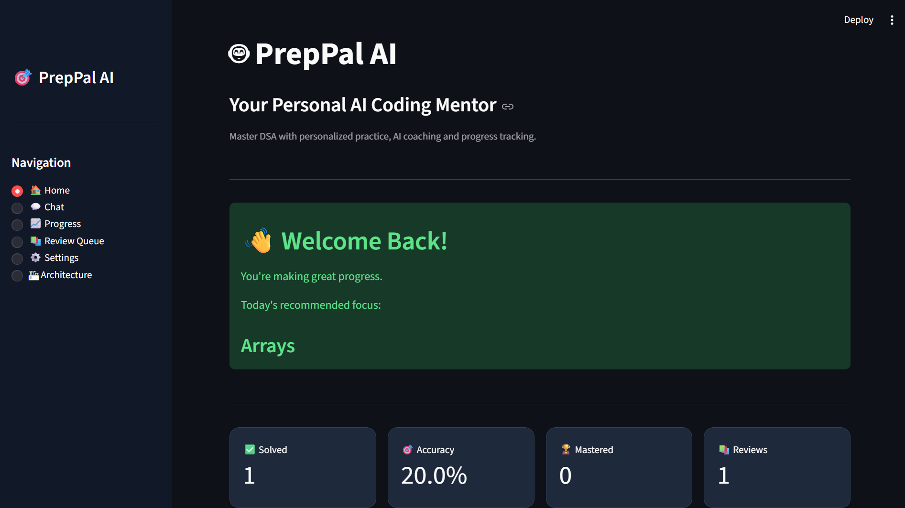
</p>

<p align="center">
  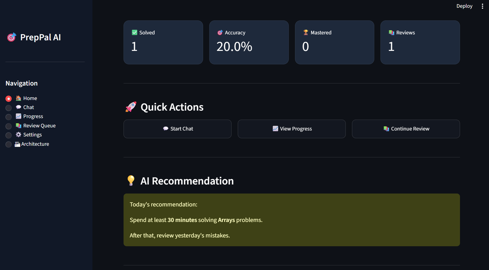
</p>

- Personalized recommendations
- Daily coding goals
- Quick actions
- AI insights

### 💬 AI Chat

<p align="center">
  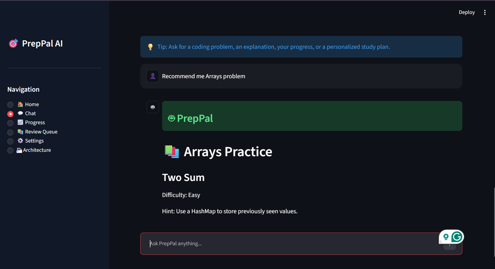
</p>

- Coding guidance
- Problem recommendations
- Concept explanations
- Study plans

### 📈 Progress Dashboard

<p align="center">
  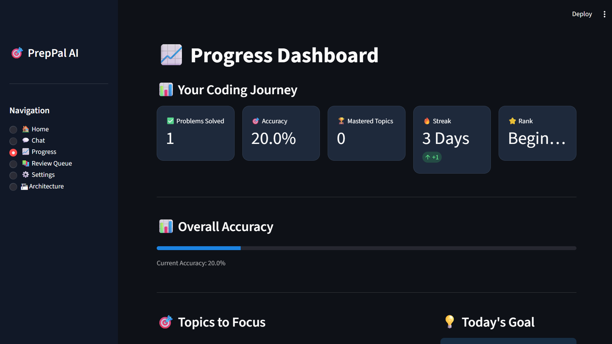
</p>

<p align="center">
  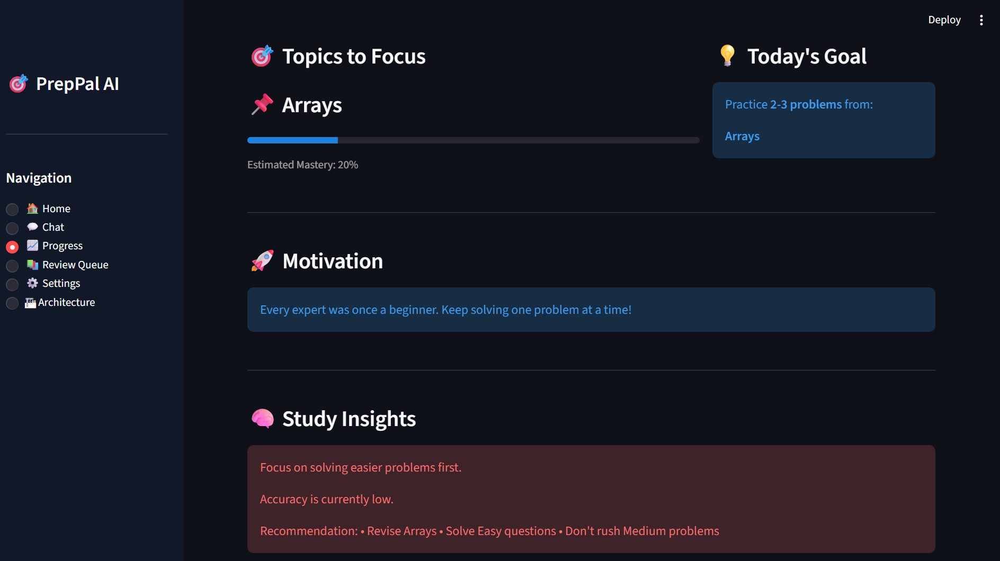
</p>

<p align="center">
  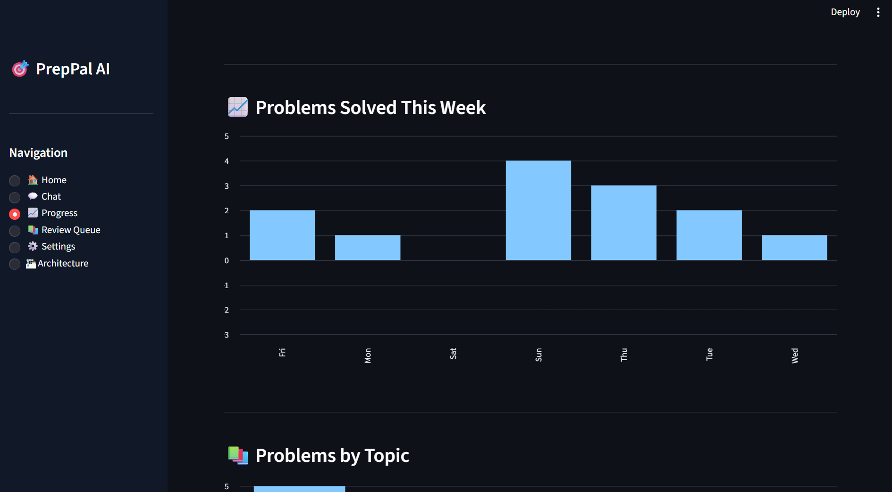
</p>

<p align="center">
  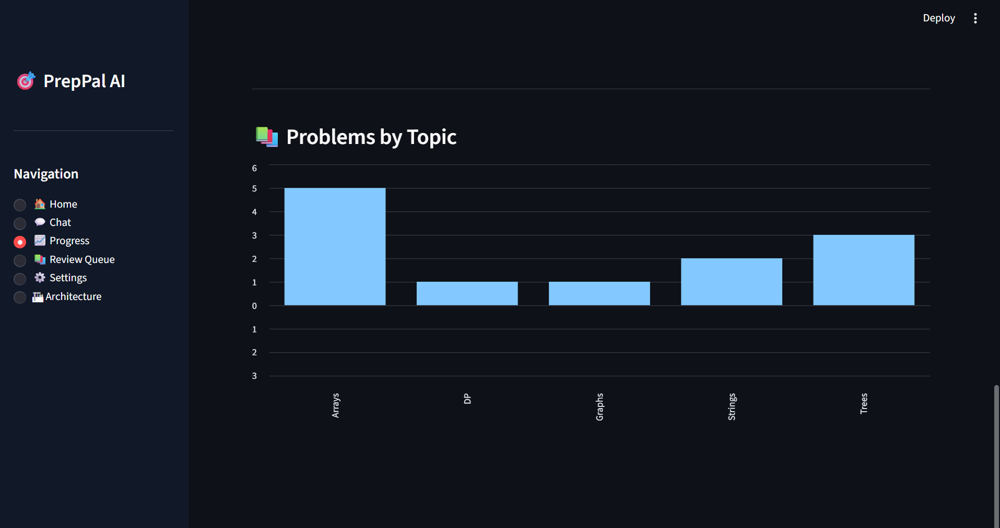
</p>

- Accuracy tracking
- Weak topic detection
- Weekly activity
- Topic distribution

### 📚 Review Queue

<p align="center">
  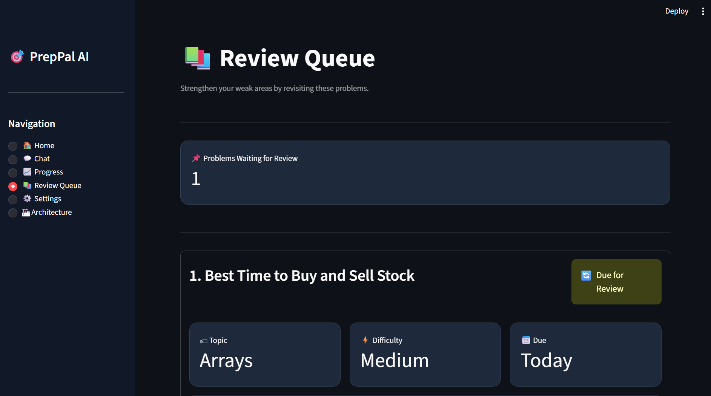
</p>

<p align="center">
  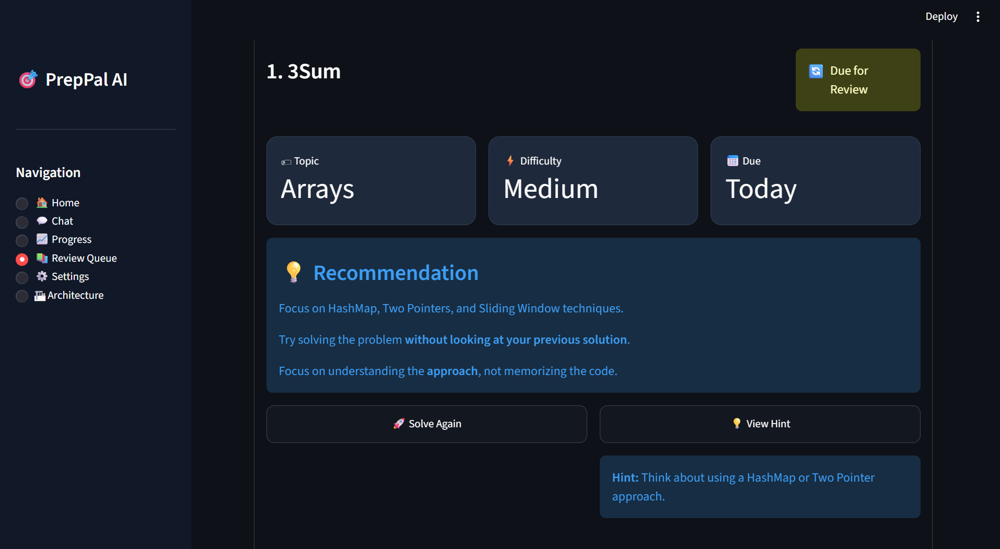
</p>

- Smart revision scheduling
- Personalized review recommendations

### 🏗 Architecture

<p align="center">
  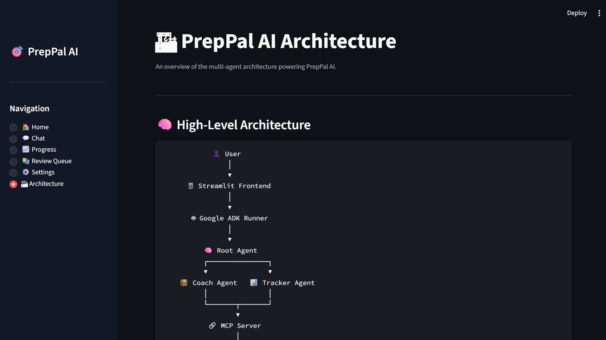
</p>

<p align="center">
  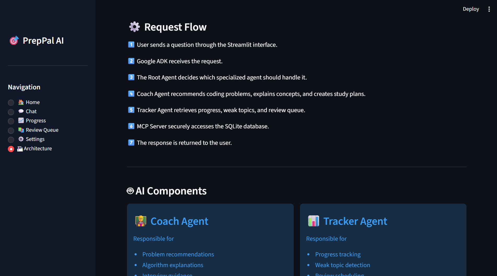
</p>

<p align="center">
  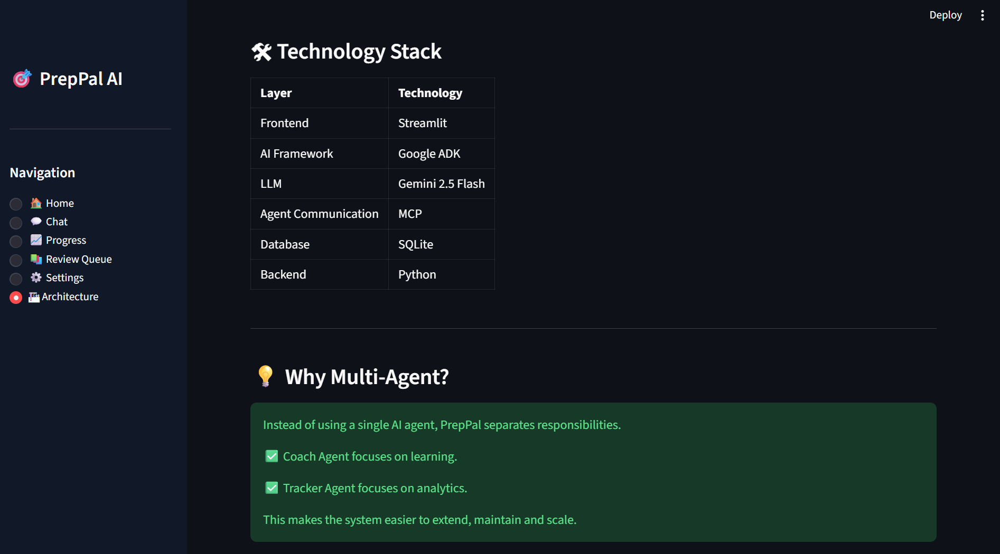
</p>

- Interactive system overview
- Request flow
- Multi-agent design

### ⚙️ Settings

<p align="center">
  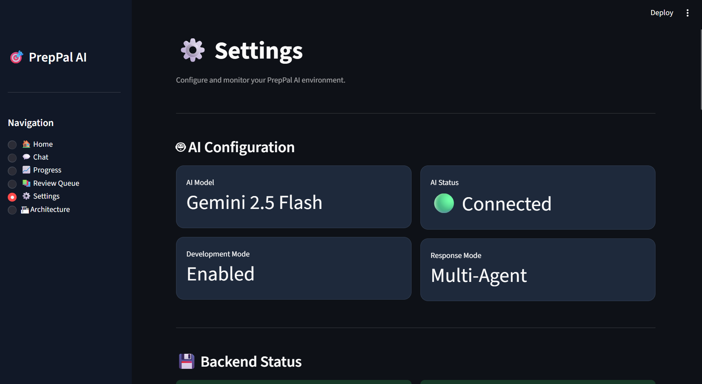
</p>

<p align="center">
  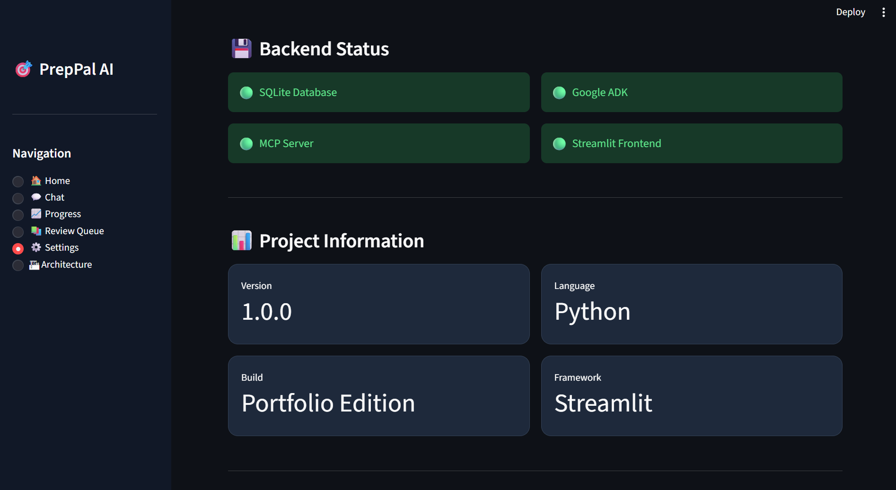
</p>

<p align="center">
  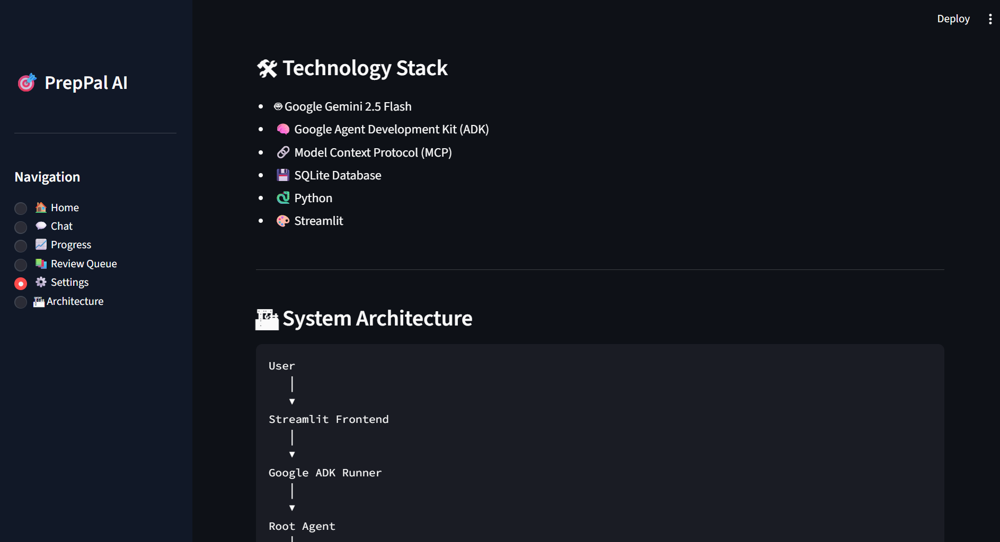
</p>

<p align="center">
  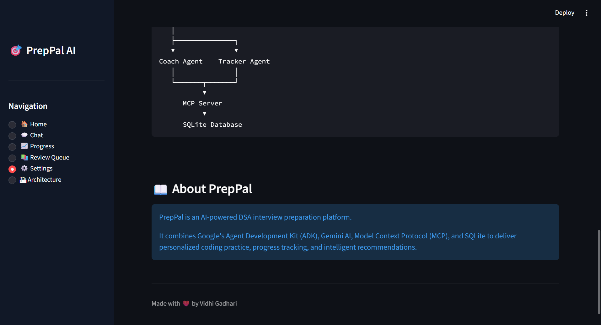
</p>

- AI configuration
- Backend status
- Development mode
- Tech stack overview

## ⚙️ Installation

```bash
git clone https://github.com/Vidhi280506/PrepPal-AI.git

cd PrepPal-AI

python -m venv .venv

source .venv/bin/activate
# Windows
.venv\Scripts\activate

pip install -r requirements.txt

streamlit run frontend/app.py
```
## 🔮 Future Scope

- Google OAuth Authentication
- LeetCode API Integration
- Real-time Coding Editor
- Voice-based AI Mentor
- Interview Simulation
- Personalized Learning Paths
- Cloud Deployment

## 📄 License

This project is licensed under the MIT License.